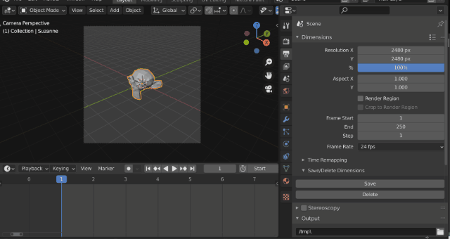

# Dimensions Per Keyframe

If you're a comic artist or such, you may want to render each keyframe in a different resolution. For example, one keyframe is portrait and another is landscape. However, Blender does not allow you to save the render dimensions at each keyframe.

With this add-on, you can save the X and Y values of the rendering resolution as markers in the timeline.

Requirements
----

* Blender >= 3.0

Installation
----

1. Download ZIP package.
2. In Blender, install via **"Edit > Preferences... > Add-ons > Install..."**

Usage
----

1. In Render Properties panel, type `Resolution X` and `Y`.
1. Press "Save" button.
1. Repeat with another keyframe.
1. When you change the keyframe, the rendering dimension which saved as a marker is loaded.
